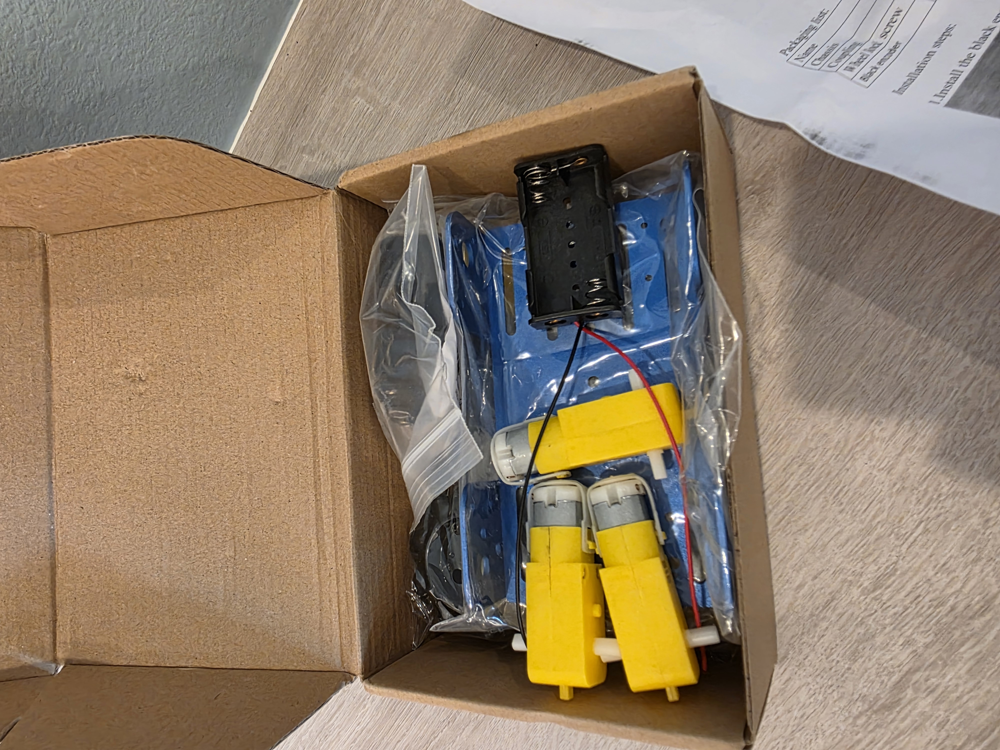
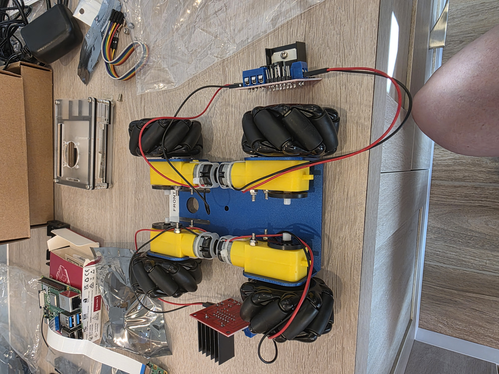

*There's a working robot car sitting in my office. I've never built one, and I didn't read the manual. Here's what the build actually looked like when the AI had the knowledge and I had the hands.*


- I built the physical robot car over two sessions — chassis assembly, motor wiring, first movement
- I have zero robotics experience. I didn't read any manuals. Claude Desktop & Claude Code spec'd the parts, guided the build, and caught the problems.
- Fried two L298N motor controllers learning a lesson about polarity. Saw a spark. Smelled the smoke.
- The PM/dev-team metaphor from post #1 holds — but the collaboration is richer than "I direct, you do." The people who'll thrive with AI aren't necessarily the deepest technical experts. They're the curious and creative ones.
- Also: we've already cycled through three vision models (Llama → Qwen → Gemma) and three Claudes (Opus 4.5 → 4.6 → 4.7) in three months. Don't get locked in.


---

## Where We Left Off

In the [first post](https://brianhengen.us/posts/01-the-prompt-is-the-program/), I made the case that operating systems built for humans aren't optimized for AI users, and I described AIOS:ThinkTank — a robot car driven entirely by a local language model — as the experiment testing that idea.

What I glossed over: how the car actually got built.

I'm not a roboticist. I've never assembled a chassis, wired a motor controller, or flashed a Raspberry Pi for a hardware project. Before this build, I couldn't have told you what an L298N was. I did not, at any point, read a manual or even watch YouTube videos about doing a build like this.

There's now a working robot car in my office. If AIOS:ThinkTank ends up being the little hero of a bigger story — the one where we figure out what an AI-native operating system actually looks like — this is his origin story.

That gap — between "never done this" and "working hardware" — is what this post is about.

---

## Naming the Thing

Before touching hardware, we needed a name. After some back and forth with Claude, we landed on **AIOS:ThinkTank**. AIOS for the thesis (AI Operating System). ThinkTank for the vehicle — it thinks, it's vaguely tank-like with its mecanum wheels. The colon gives it a namespace feel, in case there's ever an AIOS:Drone or AIOS:Arm.

Then came a small decision that felt bigger than it was. Setting up the Pi, I needed a username and password. The whole point of this project is that the AI is the user of this machine, not me. So I let Claude pick:

- **Username:** `aios`
- **Password:** `IAmTheOperatingSystem`

A small thing. But every time I log into that Pi, I'm reminded the machine isn't meant for me.

GitHub repo went up the same session: [github.com/bjhengen/aios-thinktank](https://github.com/bjhengen/aios-thinktank). Public from day one. If I was going to test a thesis, I figured I should do it in the open.

---

## The Voltage Problem

The chassis kit arrived. Metal frame, four TT motors, four mecanum wheels, a battery holder, some L298N motor driver boards. Ten minutes into unboxing, Claude asked me to read off the specs on the motors and the battery pack.

- Battery pack: 6× AA = **9V nominal**
- TT motors: rated **3–6V**

I would not have caught that. I would have assembled everything, connected the battery, and burned out four motors in approximately one second.



Claude caught it from a photo and a spec sheet. That became the pattern: when I hit a problem, I didn't Google it or pore through manuals — I'd take a picture from my phone, sometimes three, and upload them to Claude. It'd review, think for a beat, and come back with next steps. The build had its own debugging loop.

The fix was two-part: cap the PWM duty cycle at 80% in software (giving us ~6V effective voltage through the L298N's natural voltage drop), and order a 4× AA battery holder for a clean hardware fix later. Five dollars and a software cap saved the build.

The part that struck me: the kit *shipped* with a 6-cell holder and 6V motors. Someone at the manufacturer didn't think that through. And if I'd been building alone, I wouldn't have either.

---

## The Missing Wires

Next snag, same session. The motors had bare solder tabs. No wires. The chassis kit apparently assumes you'll solder your own leads on.

I didn't own a soldering iron. I have jumper wires for pin headers, but nothing that'll grip a flat solder tab.

Claude's read on it was pragmatic: don't buy specialty connectors and a soldering kit for one task. For $7, you can get replacement TT motors with wires pre-attached, same form factor. Swap them in when they arrive and skip the problem.

That's the call I would have made too — *if I'd known the option existed*. Instead I would have spent an afternoon researching solder alternatives and wired the whole thing worse than the $7 replacement would have come out of the box.

Session one ended with a GitHub repo, a Pi booted and talking to WiFi, a camera tested, a chassis assembled, and two parts ordered to fix problems we'd caught before they mattered. The boring parts, done right.

---

## The Expensive Lesson

Session two was supposed to be the easy one. Motors arrive, battery holder arrives, wire everything up, spin the wheels.

The L298N H-Bridge motor driver has three power-related terminals: **12V** (input, for motor power), **GND** (common ground), and **5V** (a *regulated output* from the onboard regulator, meant for powering downstream devices like an Arduino).

I connected the battery positive to the 5V terminal.



What happened next, in order:

1. Spark.
2. Small electric shock through the wire I was still holding.
3. The board's LED blinked once, bright, and died.
4. Faint smell of burnt electronics.

The 5V terminal is an *output*. Feeding external power into it backfeeds the voltage regulator and fries it instantly. I had, in a single motion, learned what that terminal was for and also made it stop being for anything.

I checked with Claude. Yep — battery positive goes to **12V**, not 5V. The board was permanently dead.

Fortunately, the kit came with two L298Ns and we only needed two. So I wired up the second one.

I also connected *that one* wrong, the same way.

Two boards. Same mistake. Two minutes apart. Thankfully, Amazon Prime exists.

Claude's feedback, in retrospect, was correct. It had told me "12V terminal, not 5V" both times. Both times I looked at the board, saw the labels close together, and connected them anyway. The AI had the knowledge. I had the hands. The hands made a decision the knowledge disagreed with.

Which brings me to the thing I keep thinking about.

---

## Who's the PM Now?

In the first post, I described working with Claude Code as being the PM of an AI dev team. I define requirements, review output, iterate. Claude writes the code.

That metaphor still fits — but the build modifies it in a way that's worth calling out.

I spent years as a PM for complex enterprise software. I wrote product feature guides, defined requirements, worked through architecture trade-offs with engineering. I didn't write the code. I didn't need to. I knew what the product needed to do and why, and a team of engineers knew how to make the product do it. We shipped a lot of good software that way.

This project is that same division of labor, but stretched further than it used to go. For the software, I define what the car needs to do and Claude implements it. For the hardware build, Claude knew what an L298N was and I didn't, so Claude directed and I was the hands. In both cases, I'm bringing the *what* and the *why*; the collaboration brings the *how.*

What's different now is how far that pattern reaches. Even just a year or two ago, a PM with an idea for a robot car would have needed to hire a team, fund it, manage it, wait months. I described a thing I wanted to try, and eight weeks later I had a working prototype sitting on my desk. The barrier to "I have an idea, let me try it" has collapsed.

Which is why I keep telling people: the ones who are going to thrive as AI gets more capable aren't necessarily the deepest technical experts. They're the curious ones. The ones who poke at things, ask what else is possible, try the experiment they couldn't have run six months ago. Technical depth still matters. But creative range — the range to see a problem, imagine a solution, and actually try it — is the thing that scales now in a way it never did before. This applies to software and hardware projects — but the pattern holds well beyond that. Artists, musicians, writers, designers — all now have tools that enable creative range in ways never before possible.

I started out with no real knowledge about how to build a robot car. I had an idea and a reason to try. That turns out to be enough.

(To be fair: the project was my idea. I'm holding on to that one.)

---

## Don't Get Married to a Model

One more thing worth saying, because it's come up in a lot of customer conversations recently.

When I started this project, the vision model was Llama 3.2 Vision. We moved to Qwen 2-VL, then Qwen3.5-27B. We benchmarked that against Qwen3.6-35B (Q5_K_M), and we're currently running **Gemma 4 26B A4B (Q6_K)** for the driving loop. Now that Qwen3.6-27B (dense) has shipped, I'll be testing that next. That's three vision models actively running in three months, plus a handful of serious bakeoffs between them — each swap justified by actual evaluation, not because the new one was trending.

On the dev-team side, the Claude model has cycled too: Opus 4.5 when we started, then 4.6, now 4.7. Same project, different models, noticeable step-ups each time.

The pattern matters. If we'd locked our architecture around Llama 3.2 Vision — built all our prompts, our sanitizers, our telemetry around its specific quirks — the switch to Qwen would have been a rebuild instead of a swap. Same on the Claude side. The interfaces stay stable; the models behind them are swappable.

The lesson I've been giving customers is the same one this project keeps teaching me: **don't chase the hype, and don't get married to an LLM or even a model family.** The best model today is not the best model in six months. Build systems where the model is a *component*, not the foundation. Build an evaluation harness so you can actually tell when a swap is an upgrade and when it's just new. Be ready to test and be ready to move.

A few months ago, Llama 3.2 Vision was the obvious choice. Today it's Gemma 4. In a week, it may be something else. The hardware will still work. The interfaces will still hold. That's the point.

---

## First Movement

Fresh L298N boards wired correctly. Motors swapped in. Battery holder cycled to 4× AA. Pi booted, SSH'd in from the workstation, dependencies installed (`python3-picamera2`, `python3-rpi.gpio`, a stack of stuff `apt` pulled in behind them).

The motor test:

```bash
ssh thinktank "cd ~/robotcar && python3 -m pi.car_hardware --test-motors"
```

```
2026-01-24 18:40:27 - pi.motor_controller - INFO - Starting motor test sequence...
2026-01-24 18:40:27 - pi.motor_controller - INFO - Testing: Forward
2026-01-24 18:40:28 - pi.motor_controller - WARNING - EMERGENCY STOP
2026-01-24 18:40:28 - pi.motor_controller - INFO - Testing: Backward
2026-01-24 18:40:29 - pi.motor_controller - WARNING - EMERGENCY STOP
2026-01-24 18:40:30 - pi.motor_controller - INFO - Testing: Rotate Left
2026-01-24 18:40:31 - pi.motor_controller - WARNING - EMERGENCY STOP
2026-01-24 18:40:31 - pi.motor_controller - INFO - Testing: Rotate Right
2026-01-24 18:40:32 - pi.motor_controller - WARNING - EMERGENCY STOP
2026-01-24 18:40:33 - pi.motor_controller - INFO - Motor test complete
```

All four wheels spinning. Forward, backward, rotate left, rotate right. Every "EMERGENCY STOP" in that log is the safety timer doing exactly what it's supposed to — cutting power between test moves so the car doesn't launch itself off the desk.

Then the camera test, 640×480 at 10 frames per second, JPEG sizes between 12 and 29KB. Real captures, not simulated data. The AI would have eyes.

There's something slightly ridiculous about watching four wheels spin for the first time. They're just motors responding to GPIO signals. Nothing fancy. But it meant the wiring was right, the code worked, and the thing I'd been describing in prompts for weeks was now a physical object that moved when told to move.

---

## What's Next

The hardware layer is done. The Pi captures frames. The motors respond to commands. SSH from the workstation works without a password. Everything underneath the AI is in place.

The next post is the one I've been waiting to write: the first time the AI actually drove the car. Camera frames went up to the server. Motor commands came back. The car moved because a language model looked at a picture and decided it should.

But before any of that could happen, I had to build the thing. With no experience. Without reading the manual. Guided by an AI that knew more about motor controllers than I did, which turned out to be a surprisingly comfortable way to build hardware.

Working robot car. Zero robotics background. Two dead motor controllers. One good story. And a little hero now sitting on my desk, ready for the next chapter.

On to the drive.

---

*This is part of the AIOS:ThinkTank build series. Follow along on [GitHub](https://github.com/bjhengen/aios-thinktank) or connect on [LinkedIn](https://linkedin.com/in/brian-hengen) for shorter-form updates and video clips.*

## About the Author
Brian Hengen is a Vice President at Oracle, leading technical sales engineering teams. The views and opinions expressed in this blog are his own and do not necessarily reflect those of Oracle.


